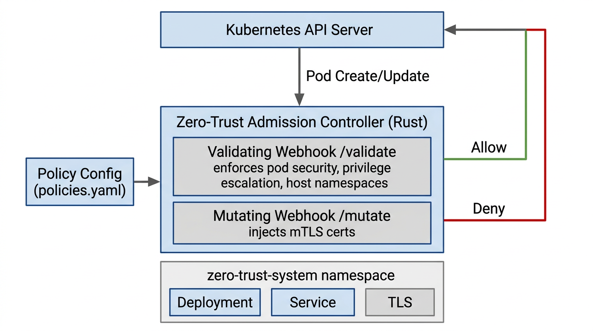

# Zero-Trust Kubernetes Admission Controller

A validating and mutating admission webhook built in Rust using [kube-rs](https://kube.rs) that enforces pod security standards and prevents privilege escalation in shared Kubernetes environments. Implements automated mTLS certificate injection and policy-as-code rules for zero-trust service-to-service authentication.

## Architecture



| Component | Role |
|-----------|------|
| **Kubernetes API Server** | Forwards Pod create/update requests to webhooks before persisting |
| **Validating Webhook** (`/validate`) | Enforces pod security policies; denies non-compliant pods |
| **Mutating Webhook** (`/mutate`) | Injects mTLS certificate volume/mounts into eligible pods |
| **Policy Config** | YAML rules loaded at startup (pod security, mTLS selector) |

## Features

- **Validating Webhook**: Enforces pod security policies (deny privilege escalation, privileged containers, host namespaces, blocked volumes)
- **Mutating Webhook**: Injects mTLS certificates into pods in zero-trust namespaces
- **Policy-as-Code**: YAML configuration for customizable security rules
- **Zero-Trust Patterns**: mTLS-ready for service-to-service authentication

## Prerequisites

- [Rust](https://rustup.rs) 1.75+
- Kubernetes cluster (e.g. [kind](https://kind.sigs.k8s.io/), [minikube](https://minikube.sigs.k8s.io/))
- `kubectl` configured to access your cluster

## Quick Start

### 1. Build

```bash
cargo build --release
```

### 2. Generate TLS Certificates & Deploy Webhooks

```bash
# For in-cluster deployment (uses Service)
./scripts/setup.sh
```

### 3. Local Development (webhook points to your machine)

```bash
# Set your machine's IP reachable from the cluster (e.g. 192.168.1.100 for kind)
export ADMISSION_PRIVATE_IP=192.168.1.100
./scripts/setup.sh

# Run the controller (requires certs from setup)
cargo run
```

### 4. Deploy to Kubernetes

```bash
# Build container image
docker build -t zero-trust-admission-controller:latest .

# Load into kind (if using kind)
kind load docker-image zero-trust-admission-controller:latest

# Deploy
kubectl apply -f deploy/deployment.yaml
```

## Configuration

Edit `config/policies.yaml` to customize security rules:

```yaml
policies:
  pod_security:
    deny_privilege_escalation: true   # Require allowPrivilegeEscalation: false
    deny_privileged: true             # Reject privileged containers
    deny_host_namespaces: true        # Block hostPID, hostIPC, hostNetwork
    blocked_volumes: [hostPath]       # Disallow dangerous volume types

  mtls_injection:
    namespace_selector:
      zero-trust.io/mtls: "enabled"   # Inject into namespaces with this label
    volume_name: "mtls-certs"
    mount_path: "/var/run/mtls"
```

## mTLS Injection

Pods receive mTLS certificate injection when:
- The namespace has label `zero-trust.io/mtls: "enabled"`, or
- The pod has annotation `zero-trust.io/mtls: "enabled"`

Ensure a secret named `mtls-certs` exists in each target namespace with the certificate and key.

## Testing

```bash
cargo test
```

### Test on Minikube (Docker driver)

1. **Start Docker Desktop** and ensure it's running.
2. Run the full test:

```bash
./scripts/test-minikube.sh
```

This will: start Minikube (if needed), build the image, deploy the controller, register webhooks, and run compliance tests.

### Manual Webhook Test

```bash
# Create a compliant pod (should succeed)
kubectl run nginx --image=nginx --overrides='{"spec":{"containers":[{"name":"nginx","image":"nginx","securityContext":{"allowPrivilegeEscalation":false}}]}}'

# Create a non-compliant pod (should be rejected)
kubectl run bad --image=nginx --overrides='{"spec":{"containers":[{"name":"bad","image":"nginx","securityContext":{"privileged":true}}]}}'
```

## Project Structure

```
├── config/
│   └── policies.yaml      # Policy-as-code configuration
├── deploy/
│   ├── deployment.yaml    # Deployment, Service, ServiceAccount
│   ├── validating-webhook.yaml.tpl
│   └── mutating-webhook.yaml.tpl
├── scripts/
│   └── setup.sh           # TLS cert generation & webhook registration
├── src/
│   ├── main.rs            # Webhook server (validate + mutate handlers)
│   ├── policy.rs          # Policy config loading
│   └── validator.rs       # Pod security validation logic
├── tests/
│   └── validator_test.rs
├── Cargo.toml
└── Dockerfile
```

## Environment Variables

| Variable | Default | Description |
|----------|---------|-------------|
| `ADMISSION_PRIVATE_IP` | `0.0.0.0` | Bind address (use your IP for local dev) |
| `POLICY_CONFIG` | `config/policies.yaml` | Path to policy file |
| `TLS_CERT_FILE` | `admission-controller-tls.crt` | TLS certificate path |
| `TLS_KEY_FILE` | `admission-controller-tls.key` | TLS key path |

## License

MIT
