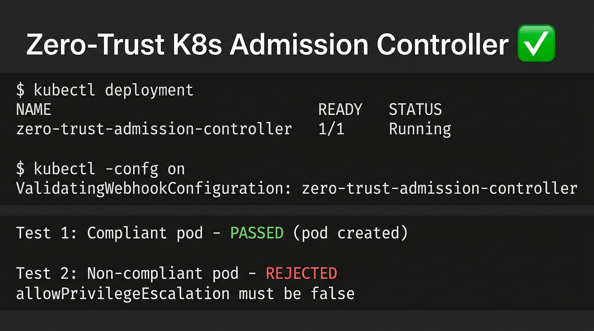

# Zero-Trust Admission Controller - Verification

This document captures the admission controller running and enforcing policies on Minikube.

## Screenshot: Working State



## Test Results (Minikube / Docker)

### Controller Status

```
NAME                                               READY   STATUS    RESTARTS   AGE
zero-trust-admission-controller-5c8866dcfc-s8vnl   1/1     Running   0          7m45s
```

### Test 1: Compliant Pod

Pod with `allowPrivilegeEscalation: false` and `privileged: false`:

```
$ kubectl run test-compliant --image=nginx --restart=Never \
  --overrides='{"spec":{"containers":[{"name":"nginx","image":"nginx","securityContext":{"allowPrivilegeEscalation":false,"privileged":false}}]}}'

pod/test-compliant created
```

**Result:** Allowed (pod created successfully)

### Test 2: Non-Compliant Pod

Pod without required security context (allows privilege escalation by default):

```
$ kubectl run test-bad --image=nginx --restart=Never

Error from server: admission webhook "zero-trust-pod-security.default.svc" denied the request: 
container[0]: allowPrivilegeEscalation must be false (privilege escalation not allowed in zero-trust environment)
```

**Result:** Rejected by webhook

## Summary

| Test | Expected | Actual |
|------|----------|--------|
| Compliant pod (securityContext set) | Allow | Created |
| Non-compliant pod (no securityContext) | Deny | Rejected |
